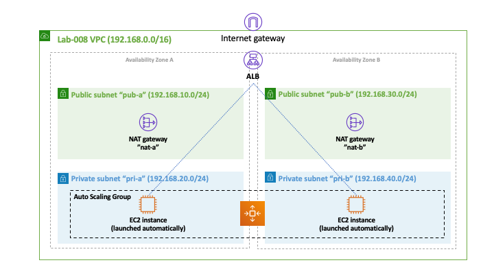

# Lab-008

## Secure EC2 Auto Scaling + Load Balancing

## Goal
This is lab is similar to [lab-007](../lab-007) with a caveat: the auto scaling group is configured to create the EC2 instances in the private subnet. Also, two security groups control traffic in and out of the application load balancer and the EC2 instances (in the private subnets). To enable the EC2 instances to respond to requests coming from the internet, NAT gateways were configured on the public subnets of the VPC.

## Architecture Diagram

## Test and Validation
Copy the public address of the load balancer and see if you can access the web server that is running on the EC2 instance that was auto-launched by the auto scaling service.

## Challenge
Modify this lab to use only one Nat gateway instead of two. Also, start the auto scaling group with two instances instead of only one.
