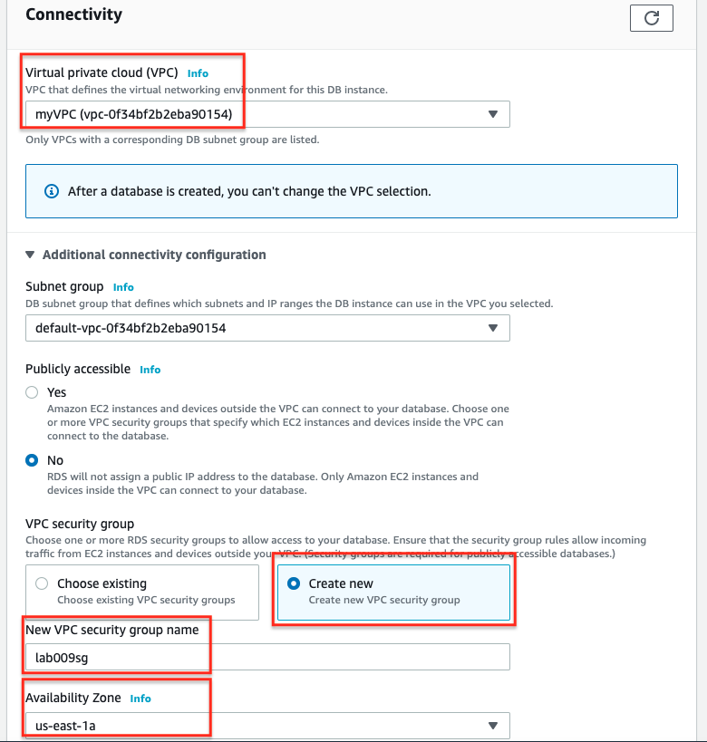
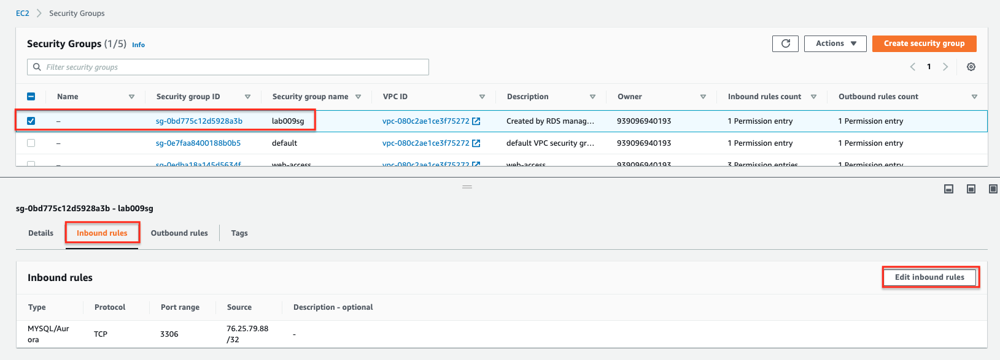
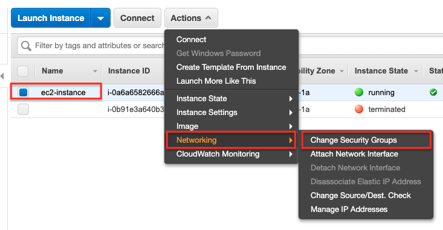
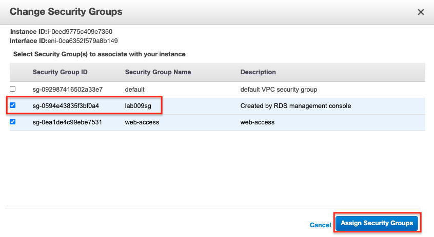
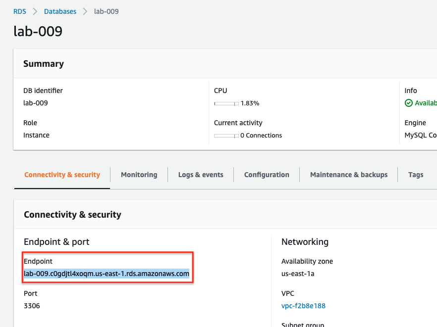
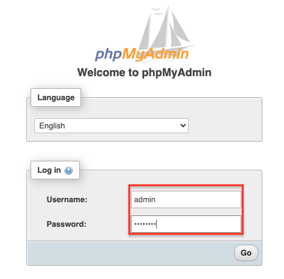

# Lab-009

## A Standalone RDS Instance Running MySQL

## Goal
This lab illustrates how to launch a standalone RDS instance running a MySQL database. An EC2 instance will also be launched to allow access to the database using phpMyAdmin. [Here](../images/RDS.png) is a mind map of RDS. 

## Architecture Diagram


## Overview
The Amazon Relational Database Service (Amazon RDS) offers a managed service based on relational databases.  In this lab you will be configuring RDS to use MySQL, an open source database. For simplicity, you will not configure more advanced features available in RDS, such as *multi-az deployment* or *read replicas*. To verify that RDS is working, you will configure an EC2 instance with Apache and phpMyAdmin, a free software tool written in PHP that simplifies administration of a MySQL database over the Web.

### Step 1 - Create a Custom VPC with Two Public subnets

Start this lab by configuring an internet gateway on a custom VPC. Make sure there is a default route for your VPC's internet gateway. Make sure your public subnets are configured in distinct AZs and that auto-assign IPv4 is enabled.

### Step 2 - Launch an RDS Instance

Below are some of the main options you should select:
* Database creation method: Standard Create
* Engine option: MySQL
* Templates: Free tier
* DB instance identifier: lab009
* Master password: 12345678 (not safe but this is just a lab)
* DB instance size: Standard classes
* Storage: default options are fine for this lab
* Multi-az deployment: if you selected the *free tier* template you should not even be able to select *multi-az deployment* options
* Connectivity: set your custom VPC to be the one where your RDS instance will run; in the additional connectivity configuration - VPC security group, choose *Create new* and name it *lab009sg*; finally for the availability zone choose the one suffixed with 1a (or the first option that appears to you)
* Additional configurations: set the initial database name to *lab009* and disable automatic backups



### Step 3 - Launch an EC2 Instance

Configure an EC2 instance in the public subnet in the same AZ where your RDS instance was launched. Use the [user-data](files/user-data.sh). Create a security group that allows SSH and HTTP access to your instance from anywhere.

### Step 4 - Modify RDS's Security Group

Modify the inbound rule of the RDS's security group to enable access from the EC2's instance.




### Step 5 - Apply RDS's Security Group to EC2 Instance

In order for your EC2 instance to be able to access the RDS instance it has to be in the same security group created in step 2.




### Step 5 - Configure phpMyAdmin

* Connect to your EC2 instance via SSH
* Run the following commands (requires privileged access):

```
cd /var/www/html
tar xvf phpMyAdmin-latest-all-languages.tar.gz
rm -rf phpMyAdmin-latest-all-languages.tar.gz
ln -s phpMyAdmin-5.0.2-all-languages phpMyAdmin
cd phpMyAdmin
cp config.sample.inc.php config.inc.php
```

Edit *config.inc.php* and search for a reference to *localhost*. Replace it with your RDS instance endpoint.



## Test and Validation

Open a browser and using the EC2 instance's public IP address, connect to the database via phpMyAdmin.

```
http://<public IP EC2 instance>/phpMyAdmin
```


