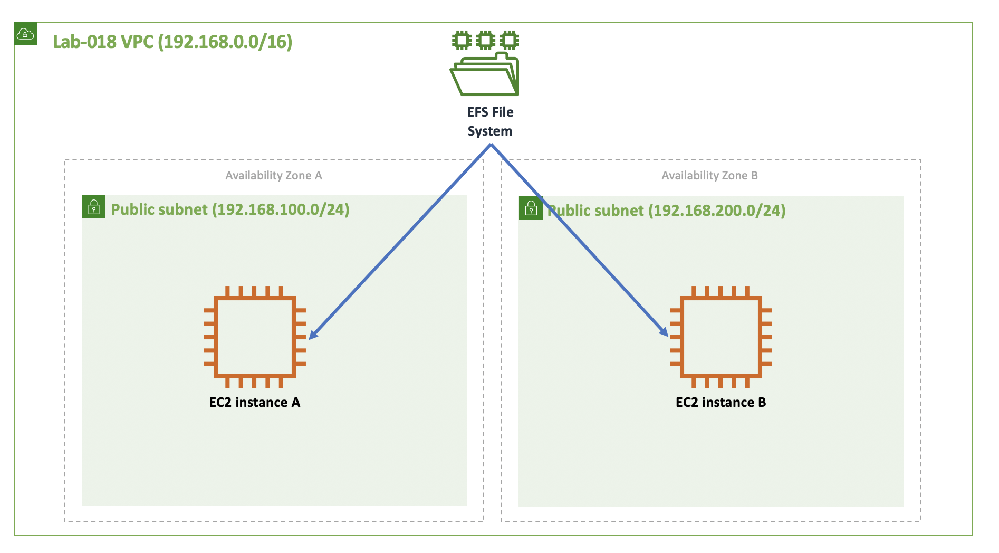
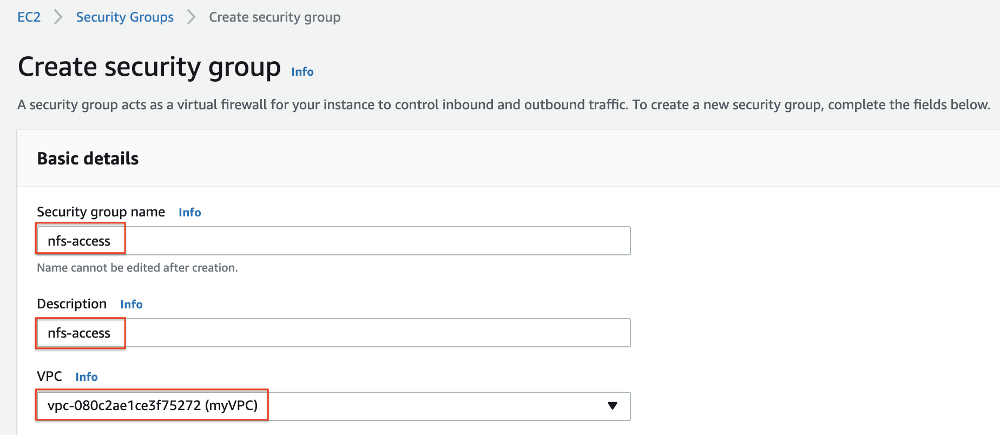
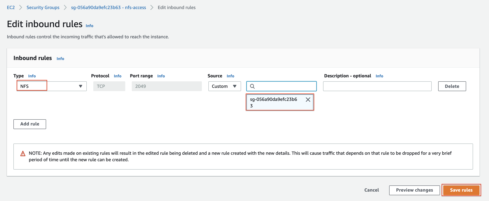
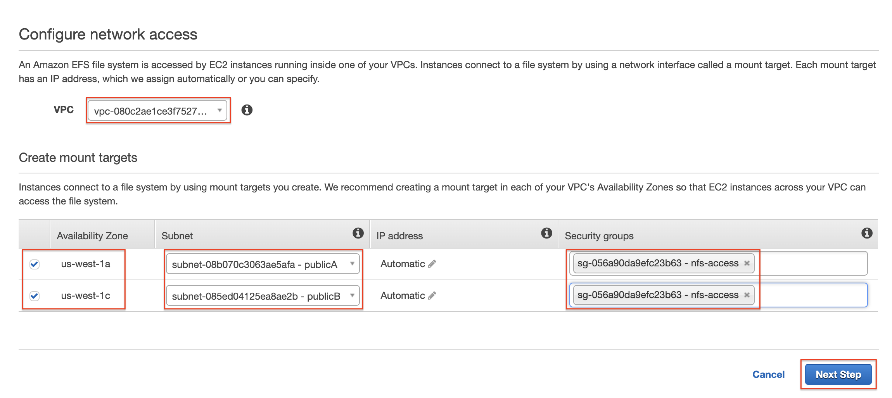
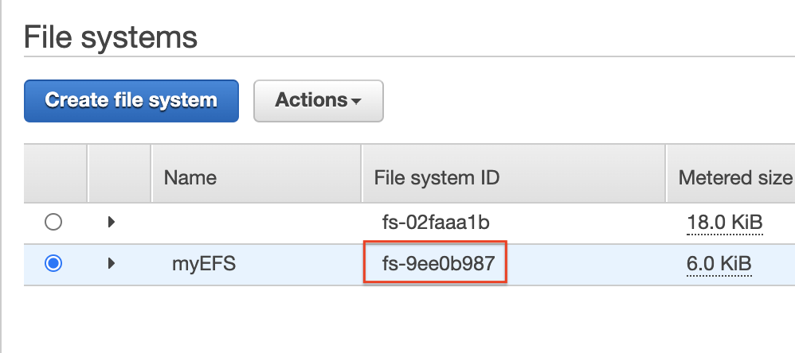

# Lab-018

## Creating and Sharing an NFS File System via EFS

## Goal
The goal of this lab is to illustrate how to create and share an NFS file system using AWS [EFS](https://aws.amazon.com/efs/) service.

## Architecture Diagram


## Overview

Create two EC2 instances in different AZs (you can use public subnets). Create an NFS file system using EFS and mount it using one of the EC2 instances. Create some files for testing purposes. Then try to mount and access the file system from the other EC2 instance. Note that the access should work simultaneously.

### Step 1 - VPC Setup

Make sure your VPC is configured to enable mounting using DNS names. You can do that by going to your VPC's action menu and selecting *Edit DNS Resolution* and *Edit DNS Hostnames*. Make sure both are set to *Yes*.

### Step 2 - Create Security Group

Create a security group named *nfs-access* to allow access to the NFS file system to members of the security group.

First Create the security group.


Then edit its inbound rule to allow access from members of the group.


### Step 3 - Launch EC2 Instances

Launch two EC2 instances, each on its own AZ. Use the [user-data.sh](files/user-data.sh) to install Amazon's EFS utility package. Make sure your instances are members of the *nfs-access* security group and are also accessed via ssh.

### Step 4 - Create an NFS File System

Go to *Storage - EFS* and click *Create file sytem*.



Copy the EFS file system ID.



### Step 5 - Mount the NFS File System

Access one of the EC2 instances using ssh. Create a folder to be the mounting point (let's say *data*). Then using your EFS file system ID (mine was *fs-9ee0b987*) issue the command:

```
sudo mount -t efs fs-9ee0b987:/ data
```

You should be able to access the file system. Create a few testing files.

## Test and Validation

Connect to the second EC2 instance (the one running on the other AZ), mount the EFS file system and see if you can access the files created earlier. Make sure you test simultaneous access (both EC2 accessing the file system).
